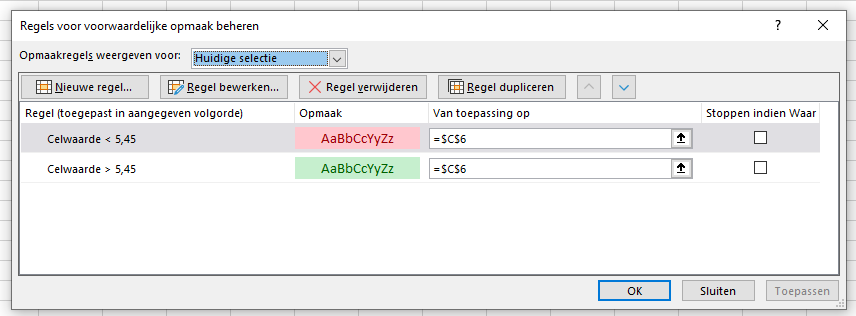
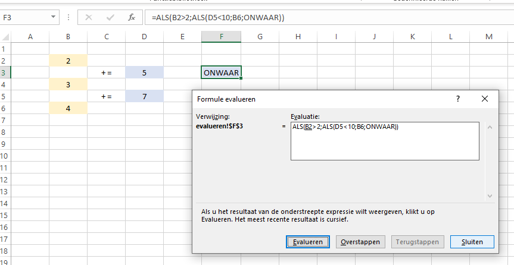
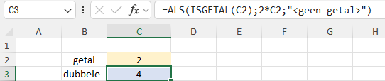

# Excel cookbook

*versie 07-11-2024*

Avans Hogeschool, Academie voor Duurzaam Gebouwde Omgeving, cursus Parametrisch Ontwerpen (DG-MI-PAO).

Document opgesteld met [Typora](https://typora.io/) editor.

Broncode beschikbaar op https://github.com/ornor/avans-excel-cookbook.

----

[TOC]

## Celverwijzingen vastzetten

Het is erg handig om formules te kunnen kopiëren/hergebruiken. Hiertoe is het vaak efficiënt *dollartekens* `$` [&Eopf;](https://support.microsoft.com/nl-nl/office/formules-verplaatsen-of-kopi%C3%ABren-1f5cf825-9b07-41b1-8719-bf88b07450c6) te gebruiken om bepaald rijen en/of kolommen vast te zetten bij het kopiëren en plakken. Normaal gesproken wordt een verwijzing automatisch aangepast op de doelcel. Bij gebruik van dollartekens blijft de verwijzing hetzelfde als in de cel waar die is gekopieerd.

In onderstaande voorbeeld is de formule in cel C5 gekopieerd en geplakt in de overige blauwe cellen. Cel B2 moet overal gebruikt worden. Bij het plakken één cel rechts van C5 moet deze verwijzing naar B2 NIET worden aangepast naar C2 (dit zou anders gebeuren). Door gebruik van dollartekens zal ALTIJD de nieuwe cel verwijzen naar cel B2. 

In de blauwe cel zijn zowel de rij als kolom vastgezet. In de rode cel is alleen de rij 4 vastgezet (de kolommen moeten juist WEL automatisch aangepast worden om de juiste kolomletters te krijgen). En de paarse cel is juist alleen de kolom B vastgezet (en de rijen niet).

## Werken met namen en gegevensvalidatie

Er kan in een formule worden verwijzen naar andere cellen d.m.v. het adres (bijvoorbeeld `$A$2`). Het is ook mogelijk om een bepaalde cel, of een bereik meerdere aaneengesloten cellen een *naam* te geven [&Eopf;](https://support.microsoft.com/nl-nl/office/namen-defini%C3%ABren-en-gebruiken-in-formules-4d0f13ac-53b7-422e-afd2-abd7ff379c64).

In bovenstaande voorbeeld wordt de inhoud van een balk uitgerekend. Cel C2 krijgt nu de naam `b` door deze te selecteren en vervolgens in het witte invoervakje links naast de formule werkbalk, de nieuwe naam te typen (en op `ENTER` te drukken).

Als je nu de nieuwe formule (met namen) in cel C6 gaat typen, dan zie je ingevoerde naam ook in de keuzelijst terug komen (tijdens het typen). 

Het voordeel van het geven van een naam, is dat het niet uitmaakt waar de breedte-waarde staat. Zolang het bereik van de naam `b` maar naar juiste invoerveldje gaat, komt het goed. Mocht je later de formules willen veranderen, omdat je een anders invoerveld wilt gebruiken voor de breedte-waarde, dan hoef je NIET alle formules aan te passen (want naam klopt dan nog steeds), maar je hoeft alleen het bereik van de naam aan te passen. Dit kan je doen via het tabblad "Formules" bij de knop "Namen beheren". Selecteer de naam en pas het bereik aan via de knop "Bewerken".

Een ander voordeel van namen geven is dat de formules leesbaarder kunnen worden.

Een nadeel van namen geven is, dat als je alle cellen op werkblad wilt kopiëren (om voor een tweede keer te gebruiken), je maar één waarde voor één naam kan hebben. Je moet dus dan het gekopieerde nieuwe (unieke) waarden geven.

Namen zijn erg handig in combinatie met *gegevensvalidatie* [&Eopf;](https://support.microsoft.com/nl-nl/office/gegevensvalidatie-toepassen-op-cellen-29fecbcc-d1b9-42c1-9d76-eff3ce5f7249). 

Stel je hebt een lijst met namen van personen. En je wilt dat je in een andere cel (eventueel op een ander tabblad) in een cel kan kiezen tussen deze personen (in onderstaande situatie is dat cel F8). Dan is het handig om een keuzelijst te hebben (om te zorgen dat je nooit een niet geldige naam kan typen). Om dat te doen, ga je naar tabblad "Gegevens" naar de knop "Gegevensvalidatie". 

Je krijgt dan een popup menu met de volgende opties. Bij het vakje "toestaan" kan je restricties meegeven welke waarden gebruikt mogen worden. In dit geval kies je voor je voor "lijst" (i.p.v. "alle waarden"). Je kan dan naast het vakje van "Bron" klikken op het pijltje omhoog om de cellen F3:F6 te selecteren. Je hebt nu een keuzelijst gemaakt.

Een nadeel is dat als de lijst met later nog wordt aangepast, je ook alle gegevensvalidaties moet gaan aanpassen. Ook is het een nadeel dat je geen cellen kan selecteren van andere tabbladen (bij de invoeroptie "Bron"). Beiden kunnen opgelost worden door de invoercellen een naam te geven. Vervolgens type je bij "Bron" een `=` met daarachter de naam die je aan invoerbereik hebt gegeven.

 

Een andere interessante functie bij gegevensvalidatie, is het toevoegen van helptekst als een gebruiker een bepaalde cel selecteert. In dit geval kunnen we hierboven bij het tabblad "Invoerbericht" dit bericht nog invoeren.

 

## Waarde zoeken in tabel

Functies als `HORIZ.ZOEKEN` en `VERT.ZOEKEN` worden veel gebruikt om waarden in een datatabel op te zoeken. Echter bij deze functie moet een totaal bereik van hele tabel worden opgegeven. Ook moet een rij- of kolom index getal worden aangegeven. Als datakolommen of -rijen worden toegevoegd of aangepast, dan is het niet altijd duidelijk of de zoekfuncties nog juist zijn.

Een andere manier om waarden op te zoeken is de combinatie van de functies `INDEX` [&Eopf;](https://support.microsoft.com/nl-nl/office/index-functie-a5dcf0dd-996d-40a4-a822-b56b061328bd) en `VERGELIJKEN` [&Eopf;](https://support.microsoft.com/nl-nl/office/vergelijken-functie-e8dffd45-c762-47d6-bf89-533f4a37673a).

In dit geval kan in een geel vakje een naam worden ingegeven (met behulp van keuzemenu door 'lijst' in *gegevensvalidatie* [&Eopf;](https://support.microsoft.com/nl-nl/office/een-vervolgkeuzelijst-maken-7693307a-59ef-400a-b769-c5402dce407b)) en wordt de bijhorende woonplaats opgezocht. De functie `vergelijken` zoekt de hoeveelste cel de naam (in gele vakje) in de deelnemerslijst is. De functie `index` haalt de zoveelste waarde uit het bereik van de woonplaatsen.

Gebruik bij de functie `vergelijken` altijd de '0' als 3e parameter om betrouwbare resultaten te krijgen.

Je ziet nu heel duidelijk van welke cellen deze formule afhankelijk is (dat minder het geval is bij `VERT.ZOEKEN`).

Je kan het bereik van cellen nog verbeteren met gebruik van *dollar-tekens* om celrichtingen vast te zetten bij kopiëren [&Eopf;](https://support.microsoft.com/nl-nl/office/formules-verplaatsen-of-kopi%C3%ABren-1f5cf825-9b07-41b1-8719-bf88b07450c6). Ook kan gekozen worden om bereik een *naam* te geven [&Eopf;](https://support.microsoft.com/nl-nl/office/namen-defini%C3%ABren-en-gebruiken-in-formules-4d0f13ac-53b7-422e-afd2-abd7ff379c64).

## Functies met 'ALS'

Excel heeft een aantal functies met 'ALS' daarin zoals: `SOM.ALS`, `PRODUCT.ALS` en `AANTAL.ALS`. Deze functies zijn erg handig om twee stappen in één keer te doen (je hebt dan geen hulpcellen nodig als tussenuitkomst om iets uit te rekenen).

In dit geval wordt alle blauwe cellen opgeteld (SOM) wanneer deze groter of gelijk zijn aan 5,5 (in dit geval 7,0 + 6,9). Deze wordt gedeeld door het aantal voldoendes (in dit geval 2). Dit geeft het gemiddelde van alleen de voldoendes.

Deze formule had trouwens nog korter kunnen worden opgesteld door gebruik te maken van de functie `GEMIDDELDE.ALS`.

## Berekenen van gewogen gemiddelde

Soms wil je niet een normaal gemiddelde berekenen, maar een gemiddelde gewogen naar en bepaalde weegfactor.

De functie `SOMPRODUCT` [&Eopf;](https://support.microsoft.com/nl-nl/office/somproduct-functie-16753e75-9f68-4874-94ac-4d2145a2fd2e) gaat per element de ene lijst vermenigvuldigen met de andere lijst, om vervolgens deze resultaten op te tellen. In dit geval: 4 * 3 + 7 * 1 + 8 * 2. Het gewogen gemiddelde is in dit voorbeeld een 5,83.

## Celverwijzingen ontkoppelen of relatief maken

De functie `INDIRECT` [&Eopf;](https://support.microsoft.com/nl-nl/office/indirect-functie-474b3a3a-8a26-4f44-b491-92b6306fa261) kan een waarde van een andere cel verkrijgen zonder dat deze gekoppeld is. Als in onderstaande voorbeeld de cel C3 wordt verplaats (d.m.v. knippen en plakken), zal de verwijzing in cel F3 dan ook NIET mee veranderen (wat normaal wel het geval is).  Normaal is dat ongewenst maar er zijn situaties waarin dat juist gewenst kan zijn.

Stel de data in kolommen B t/m D is uit een externe bron gekopieerd en hier geplakt. Vervolgens wil je hier nieuwe data overheen plakken (omdat deze is veranderd). Het kan dan zijn dat je per ongeluk de oorspronkelijke data eerst verwijderd en hiermee ook alle koppelingen verwijderd. Vervolgens plak je de nieuwe data maar alle verwijzingen kloppen niet meer. Om dit probleem te tackelen kan je gebruik maken van de functie `INDIRECT`. Als je dan nieuwe data erin plakt, weet je zeker dat de cel F3 de juiste waarde ophaalt aangezien deze niet afhankelijk was van koppelingen. Wel is het belangrijk dat je de data structuur (bijvoorbeeld aantal kolommen) niet aanpast, want anders klopt de formule niet meer.

Je kan ook gebruik maken van verwijzingen naar andere cellen om indirect (relatief) een koppeling te maken met een cel. Een voorbeeld is hieronder gegeven.

De functie `ADRES` [&Eopf;](https://support.microsoft.com/nl-nl/office/adres-functie-d0c26c0d-3991-446b-8de4-ab46431d4f89) geeft een tekst-celverwijzing gebaseerd op een rij- en kolomnummer. Hiertoe wordt nu de functie `RIJ` [&Eopf;](https://support.microsoft.com/nl-nl/office/rij-functie-3a63b74a-c4d0-4093-b49a-e76eb49a6d8d) gebruikt om vanuit de blauwe verwijzing een rijnummer (3) te verkrijgen en met de functie `KOLOM` [&Eopf;](https://support.microsoft.com/nl-nl/office/kolom-functie-44e8c754-711c-4df3-9da4-47a55042554b) een kolomnummer (2 (= B)) van rode verwijzing te verkrijgen. De leeftijd van Jan is nu niet direct gekoppeld aan de cel waar deze waarde staat (deze kan dus geknipt/verwijderd worden zonder dat er foutmeldingen ontstaan). Mocht er een kolom tussen A en B gevoegd worden, zal het (in tegenstelling tot 1e voorbeeld) ook goed blijven gaan omdat deze de juist kolomnummer vanuit rode cel mee krijgt.

Je kan ook een verwijzing maken naar bijvoorbeeld een cel rechts van een andere kolom, door het kolomnummer te verhogen met 1.

Of je kan aangeven dat je het laatste kolomnummer van een bepaald bereik wilt hebben.

## Werken met tekst

In Excel formules kan gewerkt worden met tekst. Alles tussen dubbele aanhalingstekens is tekst. Zie volgende overzichtspagina met alle tekst functies: [&Eopf;](https://support.microsoft.com/nl-nl/office/tekstfuncties-overzicht-cccd86ad-547d-4ea9-a065-7bb697c2a56e)

Tekst kan worden gecombineerd (aan elkaar geplakt) door middel van de operator: `&` [&Eopf;](https://support.microsoft.com/nl-nl/office/tekst-samenvoegen-functie-8f8ae884-2ca8-4f7a-b093-75d702bea31d).

Een getal (of andere niet-tekstuele waarde) kan worden omgezet naar tekst met de functie `TEKST` [&Eopf;](https://support.microsoft.com/nl-nl/office/tekst-functie-20d5ac4d-7b94-49fd-bb38-93d29371225c). Hierbij moet worden aangegeven in welk format de waarde moet worden weergegeven. Voorbeelden van dit format zijn ook te vinden bij *celeigenschappen* (ctrl+1), tabblad 'getal', optie 'aangepast'.

In bovenstaande voorbeeld berekent de functie `RIJEN` het aantal rijen in het blauwe bereik. Het argument "0" geeft aan dat dit als een geheel getal moet worden weergegeven.

De functie `WAARDE` [&Eopf;](https://support.microsoft.com/nl-nl/office/waarde-functie-257d0108-07dc-437d-ae1c-bc2d3953d8c2) doet het omgekeerde en zet een stuk tekst om naar een getal. Onderstaande voorbeeld geeft het getal 5.

Er kan ook geknipt worden in een stuk tekst. Zodat alleen een deel van tekst gebruikt word. Zie functies `DEEL` [&Eopf;](https://support.microsoft.com/nl-nl/office/deel-deelb-functie-d5f9e25c-d7d6-472e-b568-4ecb12433028), `LINKS` [&Eopf;](https://support.microsoft.com/nl-nl/office/links-linksb-functie-9203d2d2-7960-479b-84c6-1ea52b99640c) en `RECHTS` [&Eopf;](https://support.microsoft.com/nl-nl/office/links-linksb-functie-9203d2d2-7960-479b-84c6-1ea52b99640c). De functie `LENGTE` [&Eopf;](https://support.microsoft.com/nl-nl/office/lengte-lengteb-functie-29236f94-cedc-429d-affd-b5e33d2c67cb) retourneert het aantal karakters.

Laatste formule zoekt een deel van het woord "Achmed" op, beginnend bij letter 3. Het aantal resterende letters is het aantal totale letters van dit woord minus 2 (de eerste twee letters van het woord). Dit resulteert in: "Daarna volgen de letters: hmed."

## Werkbladbeveiliging

Soms is het handig om te zorgen dat gebruikers bepaalde cellen niet per ongeluk aan kunnen passen. In onderstaande voorbeeld mag een gebruiker cel C2 aanpassen maar C4 niet. Het is mogelijk om een werkblad te beveiligen. Hierdoor worden restricties opgelegd aan de gebruiker. 

Standaard zijn alle cellen `geblokkeerd`. Dat kan je zien/aanpassen als je rechter muis klikt op die cel en dan naar "Celeigenschappen" gaat, bij laatste tabblad "Bescherming". In dit geval willen we in cel C2 het vakje weer uitvinken (zodat deze cel niet wordt geblokkeerd).

Rechter muis klik vervolgens op het tabblad onder (het werkblad) die je wilt beveiligen en klik op "Blad beveiligen". 

 

Je ziet vervolgens onderstaande menu. Hier kan je in de meeste situaties, gewoon de standaard instellingen laten staan. Deze instellingen laten het toe om alle cellen te selecteren (geblokkeerd en niet geblokkeerde) om zodoende de formules ook te kunnen zien. Het is NIET toegestaan om opmaak aan te passen. 

Je kan hierna alleen de waardes in de cellen die NIET geblokkeerd zijn veranderen. Als je een geblokkeerde cel probeert te veranderen dan krijg je de onderstaande waarschuwing.

Tip: laat het invoerveld voor een wachtwoord altijd leeg. Zodoende kan iedereen het werkblad ook weer aanpassen. Zeker als collega's vertrekken bij bedrijf, kan het zijn dat bepaalde wachtwoorden niet meer beschikbaar zijn. Dan kunnen de rekensheets niet meer aangepast worden. Je kan de beveiliging er weer afhalen door weer rechter muis knop op tabblad onderaan en kies voor "Beveiliging blad opheffen".

## Voorwaardelijke opmaak

Het kan handig zijn voor een gebruiker om visueel extra informatie te krijgen. Hierbij kan het handig zijn om de opmaak (onder andere de kleur van achtergrond en kleur van tekst) afhankelijk te laten zijn van de waarde die in de cel staat.

In onderstaande geval moet het eindcijfer groen oplichten bij een voldoende en rood worden bij een onvoldoende.

Ga naar tabblad "Bestand" en ga naar knop "Voorwaardelijke opmaak". Kies in dit geval voor "Markeringsregels voor cellen", "Groter dan" en kies voor onderstaande configuratie. Doe dat 2x: één keer voor een voldoende en één keer voor onvoldoende (dan wel "Kleiner dan").

In dit geval is er gekozen voor een vooraf ingestelde configuratie (groene opvulling met donkergroene tekst) maar je kan iedere opmaak kiezen die je zelf wilt. Bij de knop "Voorwaardelijke opmaak" bij "Regels beheren" zie je welke voorwaarden er bij de betreffende cel horen. Hier kan deze ook weer verwijderen en aanpassen.

Voorwaardelijk opmaak is (zoals de naam aangeeft) celopmaak. En deze wordt standaard mee gekopieerd als je een cel kopieert naar een andere cel. Je kunt ook alleen de opmaak (en dus ook voorwaardelijke opmaak) kopiëren met hulp van het kwastje linksboven in scherm.

## Formules evalueren

Het kan handig zijn om visueel snel te weten welke cellen een bepaalde formule gebruikt [&Eopf;](https://support.microsoft.com/nl-nl/office/de-relaties-tussen-formules-en-cellen-weergeven-a59bef2b-3701-46bf-8ff1-d3518771d507). Hiervoor is de functie "Broncellen aanwijzen" in tabblad "Formules". Zie onderstaande afbeelding. Echter kan dit effect ook gekregen worden door `F2` in te drukken om de formule te zien met bijhorende cellen (met verschillende kleuren).

Andersom kan het interessanter zijn. Bijvoorbeeld in onderstaande voorbeeld: in cel B2 staat de waarde 2, maar welke andere cellen gebruiken eigenlijk deze waarde? Om hier antwoord op te krijgen, kan je "Doelcellen aanwijzen" gebruiken. Met deze functie kan je veel sneller een nieuw rekenblad doorgronden.

Een handig optie is de functie "Formule evalueren". Hiermee kan je een ingewikkelde lange formule beetje bij beetje ontleden. Dit is handig om een formule te proberen te begrijpen of handig om een fout op te sporen. Zie hieronder.

## Werken met foutmeldingen

Om beter om te gaan met onjuiste invoer van een gebruiker, kan gebruik gemaakt worden van onder ander de volgende Excel functies (beginnend met "IS"): `ISFOUT`, `ISLEEG`, `ISNB`, `ISGETAL` etc. [&Eopf;](https://support.microsoft.com/nl-nl/office/is-is-functies-0f2d7971-6019-40a0-a171-f2d869135665). Dit in combinatie met de functie `ALS`

Hierboven wordt als voorbeeld gecheckt of er een waarde is ingevuld. Ook hadden we hier kunnen controleren of het een getal is (en geen stuk tekst) met de functie `isgetal`. Zodoende wordt de gebruiker gelijk al gewaarschuwd (en heeft anders niet door dat die iets verkeerd doet).

In bovenstaande formule wordt een minteken "-" getoond als er wel een juiste invoer is. Er kon ook gekozen worden om de cel leeg te laten bij een juiste invoer (met ""), maar doe dit niet. Want dan is er een formule in cel D2 maar niemand kan zien dat er toch een formule staat. Het is beter dat een formule ALTIJD iets laat zien (zodat men kan zien dat daar een formule aanwezig is).

## Cel verplaatsen

Er zijn twee verschillende manieren om een cel te verplaatsen [&Eopf;](https://support.microsoft.com/nl-nl/office/cellen-rijen-en-kolommen-verplaatsen-of-kopi%C3%ABren-3ebbcafd-8566-42d8-8023-a2ec62746cfc):

1) De cel `kopiëren`, vervolgens `plakken` op nieuwe locatie en dan de oude cel `verwijderen`.
2) De cel `knippen` en vervolgens `plakken` op nieuwe locatie.

Bovenstaande twee werkwijzen lijken op elkaar maar hebben verschillende effecten.

Gebruik optie 1 (kopiëren, plakken, verwijderen) als je wilt dat andere cellen nog steeds naar deze plek verwijzen (dat de cel verwijzingen dus NIET automatisch worden aangepast naar de nieuwe locatie).

Gebruik optie 2 (knippen, plakken) als er andere cellen naar deze cel verwijzen en je dat nog steeds wilt bij nieuwe locatie. Als je namelijk optie 1 doet, dan verwijzen deze formules nog steeds naar de oude positie en niet naar de nieuwe.

## Matrix formules

Als je een formule wilt repeteren, dan kan je de formule kopiëren en hergebruiken door te plakken. Wat ook mogelijk is, is om maar één keer deze formule te typen en deze op een aantal cellen tegelijk van toepassing te laten zijn. In onderstaande voorbeeld zijn de cellen F2 t/m F5 geselecteerd, vervolgens is de gegeven formule getypt, en is deze afgesloten door `CTRL + SHIFT + ENTER` te typen. Hierbij is een matrix formule gecreëerd [&Eopf;](https://support.microsoft.com/nl-nl/office/matrixformules-richtlijnen-en-voorbeelden-7d94a64e-3ff3-4686-9372-ecfd5caa57c7). 

Je kan ook zien dat het een matrix functie is, door op één van deze vier afzonderlijke cellen te klikken. Je ziet de formule dan tussen accolades `{ }` staan.

Het idee is dat je de matrix formule niet in één van de afzonderlijke cellen kan aanpassen. Want deze vier cellen delen namen een gemeenschappelijke formule. Je kan deze alleen aanpassen door al deze vier de cellen te selecteren en vervolgens de formule te wijzigen.

Het voordeel van deze aanpak is dat je een formule maar altijd op één plek hebt staan. Je kan nooit vergeten een formule ook aan te passen bij de andere soortgelijke cellen.

Matrix formules kunnen ook gebruikt worden voor een stelsel vergelijkingen met aantal onbekenden op te lossen.

In dit geval blijkt bijvoorbeeld dat de volgende vergelijking klopt:   -9 * ==-6.8== + 2 * ==143,5== + 3 * ==-114,6== = 4

## Tekeningen maken

Het kan handig zijn om bepaalde invoer weer te geven als een tekening. Zo kan de gebruiker gelijk zien welke waarden deze invoert. Als er een rij/kolom is met x-coördinaten en een rij/kolom met bijhorende y-coördinaten, kan je een tekening weergeven. Dit kan op tabblad "Invoegen", bij "Spreiding" en dan kiezen voor grafiek type "Spreiding met rechte lijnen". Of eventueel lijnen met getekende knopen. Als de gebruiker een coördinaat aanpast, verandert direct ook de afbeelding. 

Rechter muis klik op het witte vlak (de grafie) en kies voor "Gegevens selecteren".

Voeg vervolgens een reeks toe (een reeks is in dit geval één onafgebroken lijn). Je kan zoveel lijnen toevoegen als dat je wilt. Klik vervolgens op pijltje-omhoog naast "Reeks X-waarden" (en later ook voor y) om de juiste kolom te selecteren met data.

Je hebt nu een dynamische tekening.

Je kan eventueel nog bij as opties (rechter muis klik op de x-as of de y-as en klik op "As opmaken") aangeven dat de minimum en/of maximum waarde niet automatisch bepaald wordt, maar bijvoorbeeld altijd 10 is.

## Gebruik van parameters binnen een formule

Soms gebruik je in een formule vaker hetzelfde element (sub formule), dan kan de formule `LET` [&Eopf;](https://support.microsoft.com/nl-nl/office/let-functie-34842dd8-b92b-4d3f-b325-b8b8f9908999) handig zijn. Bijvoorbeeld als je wilt checken of een bepaalde cel een getal is, en afhankelijk daarvan een berekening maken, of een foutmelding geven.

In bovenstaande voorbeeld gebruik je twee keer "C2" in de formule. Je kan dit ook zo opschrijven, dan er maar één verwijzing naar C2 aanwezig is:

Bij `LET` kan je één of meerdere parameters opgeven. Dat doe je door eerst een naam te geven, dan puntkomma en dan de definitie/subformule. Vervolgens (na een nieuwe puntkomma) komt de formule, waarbij je alle namen kan gebruiken.

Voordeel is dat de naam alleen geldig is in deze ene formule en zo niet in conflict kan komen met een andere formule die zelfde naam gebruikt.

In onderstaande voorbeeld worden twee parameters gedefinieerd. Bovendien is de uiteindelijk formule "b*h" nu een stuk leesbaarder geworden. En weet iemand die deze formule bekijkt gelijk waar het over gaat, zonder de broncellen te hoeven nalopen.

Er kan ook een hele formule worden gedefinieerd met een naam. Zie voorbeeld hieronder, waarbij ook het oppervlak wordt uitgerekend van een rechthoek met "b*h".

## Variabel bereik cellen met overloopfuncties

Excel heeft de mogelijkheid om te rekenen met een lijst van invoer waardes terwijl de uitvoer maar in één cel is geformuleerd. Dat wordt `overloop` genoemd.

In onderstaande voorbeeld worden de waarden in een lijst (met bereik `B3:B7`) verdubbelt. Nu wordt niet iedere cel in kolom C een nieuwe formule getypt, maar wordt ALLEEN in de bovenste cel `C3` het bereik vermenigvuldigd met 2. Omdat de formule meerdere invoerwaarden heeft, maar omdat deze cel maar één uitvoerwaarde kan hebben, worden de cellen onder `C3` automatisch gevuld met uitkomsten. Ondanks dat in de cellen `C4:C7` geen formules staan, worden daar toch waarden weergegeven.

Als je in het 'overloopgebied' (in bovenstaande voorbeeld is dat `C4:C7`) een andere formule/waarde typt, dan geeft Excel een foutmelding `#OVERLOPEN!` [&Eopf;](https://support.microsoft.com/nl-nl/office/een-overloop-fout-corrigeren-ffe0f555-b479-4a17-a6e2-ef9cc9ad4023) omdat Excel verwacht dat je ruimte vrij houdt om formule daarboven te kunnen laten overlopen.

Je kan vervolgens weer verder rekenen met de cel `C3` INCLUSIEF het overloopgebied, door achter de verwijzing naar `C3` een hekje te typen. In onderstaande voorbeeld wordt een nieuwe kolom gemaakt door weer de helft van de waarden van kolom C te berekenen. Ook dit is weer een nieuwe overloopfunctie met overloopgebied (in kolom D).

Sommige functies zoals `ASELECT.MATRIX` (dat een n-aantal willekeurige getallen, in dit geval tussen 0 en 100, bepaalt) genereren als output meerdere waardes en zullen dus ook gebruik maken van een overloopgebied.

In bovenstaande voorbeeld kan gemiddelde 'mu' berekend worden met een hekje verwijzing naar `F5`.

## Opmerkingen in berekeningsformule

Het kan handig zijn om extra opmerkingen te plaatsen in een formule. Om extra uitleg/toelichting te geven aan diegene over de formule ZONDER dat het standaard zichtbaar is op het werkblad. Dat kan op een aantal manieren. Een zeer gebruiksvriendelijke is gebruik van de functie `N` [&Eopf;](https://support.microsoft.com/nl-nl/office/n-functie-a624cad1-3635-4208-b54a-29733d1278c9).

Deze functie zet een bepaalde waarde om naar een getal. Als je een stuk tekst (tussen dubbele aanhalingstekens) aan `N`  meegeeft, dan komt er altijd de waarde 0 uit. Je kan een formule (die een bepaald getal berekent) eindigen met `+ N("opmerking")` waardoor de uitkomst plus nul wordt gedaan (en zo geen effect heeft). Zie voorbeeld hieronder:

## Werken met macro's

In Excel is het mogelijk om bepaalde handelingen (die je vaker uitvoert) op te nemen. Zo kan je later in één klik (of sneltoets) deze routine meermaals snel uitvoeren. Voorheen heten dat *macro's* en tegenwoordig heet dat in Excel *acties*. Je vindt een aantal knoppen in het tabblad "Automatiseren".

Je kan een *actie* opnemen (op opname knop klikken: "Acties vastleggen" &rarr; "Opnemen") maar je kan ook een script schrijven (programmeren). Dit is in de taal VBA dat staat voor *Visual Basic for Applications*. Deze scripttaal wordt in alle Office programma's ondersteund.

Als je de sneltoets `ALT + F11` gebruikt, zie je een apart venster met daarin alle macro's die van toepassing zijn. Het bespreken van macro's is een vak apart en zal zodoende niet hier verder inhoudelijk behandeld worden.

Om te zorgen dat er geen virussen in Excel terecht komen (via macro's) zijn deze standaard uitgeschakeld. Ook is de bestandsextensie `.xlsx` bedoelt voor bestanden ZONDER macro's (dat is de laatste 'x'). Als je macro's wilt toestaan, moet je de extensie veranderen naar `.xlsm` waarin de laatste 'm' staat voor macro. Dit geldt ook voor andere Office bestanden: `docx`/`docm`,  `pptx`/`pptm` et cetera. Trouwens, voor template bestanden (die als READ ONLY bestand dienen om te kopiëren), wordt de 3e letter vervangen door een 't'. Bij Excel is dat dan `.xltx` en bij Word is dat `.dotx`.

Ook kan je in Excel met macro's zelf een formule-functie maken. Bijvoorbeeld een eigen variant van `GEMIDDELDE`. Zie hiervoor de documentatie [&Eopf;](https://support.microsoft.com/nl-nl/office/aangepaste-functies-in-excel-maken-2f06c10b-3622-40d6-a1b2-b6748ae8231f).

In het algemeen is het NIET wenselijk om macro's te gebruiken als dat niet hoeft. Dit vanuit veiligheidsoogpunt. Ook kan het zijn dat (door bescherming van computer) de rekensheet niet werkt bij bepaalde gebruikers. Ook hebben niet veel mensen ervaring/verstand van de macro taal VBA (dus minder mensen kunnen dit aanpassen). Gebruik macro's alleen als dat echt noodzakelijk is!!!

## MVC model toegepast op Excel

Een veelgebruikt ontwerpmodel bij programmeren van een applicatie, is het MVC model. Dat staat voor Model, View, Controller. Een beknopte Nederlandse omschrijving van dit model is [hier](https://nl.wikipedia.org/wiki/Model-view-controller-model) te vinden.

Het idee is dat (als je een Excel rekenblad maakt) je deze drie onderdelen moet scheiden van elkaar (en dus niet in elkaar laat overlopen). Als je het door elkaar gaat gebruiken, dan wordt het werkblad onoverzichtelijk en wordt de kans op fouten groter.

Hieronder wordt omschreven hoe aspecten uit dit model in Excel kunnen worden geïnterpreteerd.

### Model

Het model definieert de representatie van de informatie waarmee de applicatie werkt. Het is niet alleen de ruwe data, maar het is ook de structuur waarin deze data met elkaar is verbonden.

Stel je gaat een Excel bestand maken waar je ruwe data gebruik van internet (een data tabel met rijen en kollommen met getallen). Dan is het handig om hier een apart tabblad voor te gebruiken waar je deze data in plakt. Dit tabblad hoeft dan ook niet mooi opgemaakt te zijn, is puur om waardes binnen te halen vanuit andere tabbladen.

Mocht de data een jaar later anders zijn (je hebt een nieuwe dataset gedownload), dan hoef je alleen de oude data te vervangen door de nieuwe en de rest werkt dan weer. Tip: gebruik de functie `INDIRECT` of maak gebruik van `namen` als je naar dit data-tabblad verwijst (zie onderwerpen eerder in dit document). Want dan worden er geen verwijzingen verbroken als de data vervangen wordt.

Laat ook de geplakte data zoveel mogelijk intact qua structuur. Als je namelijk de opmaak/structuur van data tabblad door elkaar gaat halen, dan kan je later minder makkelijk deze data vervangen met recentere data.

Als je ruwe tekst data wilt importeren, gebruik dan de functie "Tekst naar kolommen" op het tabblad "Gegevens". Deze *wizard* helpt je om deze tekst om te zetten naar waardes in rijen en kolommen. Dit werkt bijvoorbeeld goed bij data in het formaat `.csv` dat staat voor Comma-Separated Values.

Data tabbladen kunnen ook goed gebruikt worden voor keuze lijstjes. Geef dit data bereik een *naam* en verwijs (bijvoorbeeld met *gegevensvalidatie*) naar deze naam.

### View

De view is datgene dat de gebruiker ziet en waar deze data invoert en resultaten ziet verschijnen. In de informatica wordt dit vaak 'GUI' (graphical user interface) genoemd. Het is belangrijk om de gebruiker te sturen in jouw Excel zodat diegene instinctief weet waar die waardes kan invoeren en waar die resultaten kan zien.

Het kan handig zijn om alle invoer en een samenvatting van uitvoer op eerste tabblad te plaatsen. En dat alle overige tabbladen dienen als *controller* en *model* (die de gebruiker niet zelf hoeft te zien. Je kan de tabbladen onderaan een achtergrondkleur geven: maak hierbij het eerste tabblad (waar de gebruiker moet zijn) felgekleurd en maak overige tabbladen grijs (zodat ze minder opvallen).

Geef alle cellen waar de gebruiker iets moet invullen eenzelfde kleur. Dit is in dit document bij de voorbeelden gedaan door deze licht geel te laten kleuren. Dan weet de gebruiker waar die moet zijn om parameters op te geven.

Het kan ook handig zijn om alle formule cellen ook een eigen achtergrondkleur te geven. Je kan hier wellicht meerder kleuren gebruiken voor meerdere typen formules. 

Laat cellen met een formule nooit leeg (dus zorg dat de formule geen leeg stuk tekst genereert). Anders heeft niemand door dat daar een formule staat en kan er iets mis gaan (als iemand later deze sheet wilt aanpassen). Zorg ook dat cellen nooit *verborgen* zijn, dat werkt vaak uiteindelijk averechts.

Maak gebruik van *werkladbeveiliging* om de gebruiker te sturen waar deze waardes kan aanpassen. Ook *gegevensvalidatie* helpt hier bij.

Probeer zoveel mogelijk om alles op één schermbreedte kwijt te kunnen. Dus dat je NIET nog verder naar rechts hoeft te scrollen om een cel te bekijken. Maar werk alleen 1D (één dimensionaal) van boven naar beneden (dus dat de gebruiker wel naar beneden kan scrollen). Onze hersenen vinden het fijn om overzicht te hebben. En een 2D rekensheet (met veel rijen en veel kolommen) maakt deze erg onoverzichtelijk. Het is fijner als de sheet een 'verhaal' is dat je van boven naar beneden kan lezen/volgen.

Je kan het beste het printgebied instellen [&Eopf;](https://support.microsoft.com/en-us/office/set-or-clear-a-print-area-on-a-worksheet-27048af8-a321-416d-ba1b-e99ae2182a7e), dat de afdrukbare A4-tjes boven elkaar staan (en dat het zichtbare gebied in de breedte van het scherm, ook de breedte van het A4-tje is). Stel hiertoe bij "Pagina-indeling" bij "Breedte" deze op "1 pagina" in (en de hoogte op automatisch).

Algemene tip: bedenk goed wie de gebruiker is! En maak je invoer/uitvoer zo dat diegene dit goed kan begrijpen. Soms moet je de invoer juist extra simpel maken en soms vraagt een gebruiker juist om veel configuratie mogelijkheden. Hoe ga je hier mee om?

### Controller

Alle cellen die het echte rekenwerk doen, horen bij de *controller*. Dit is als het ware het brein van het Excel bestand. Deze haalt data uit de data-tabbladen en haalt ook de input van de gebruiker op. Vervolgens berekent deze bepaalde waardes een geeft deze terug aan de gebruiker op het tabblad van de *view*. 

Het is verstandig om iedere verschillende soort rekentaak (of tussenstap) op een ander tabblad te zetten. Zodoende wordt het geheel stuk overzichtelijk.

Een *controller* tabblad moet overzichtelijk zijn. Niet per se voor de gebruiker (want die hoeft daar niet te komen) maar wel voor een ontwikkelaar. Zorg dat alle stappen goed gedocumenteerd zijn. Jij als maken van deze sheet weet hoe het zit, maar als jij weg gaat bij bedrijf, kan iemand anders dan deze sheet snapppen?

Een mogelijk tabbladindeling is hieronder weergegeven. In dit geval is 'controller 2' geselecteerd en heeft zodoende iets andere kleur nu.

De gebruiker weet nu direct (instinctief) dat die naar gele tabblad moet gaan.

Je kan ook kiezen om de invoer en (printbare) uitvoer uit elkaar te halen. Dus ieder op apart tabblad.
